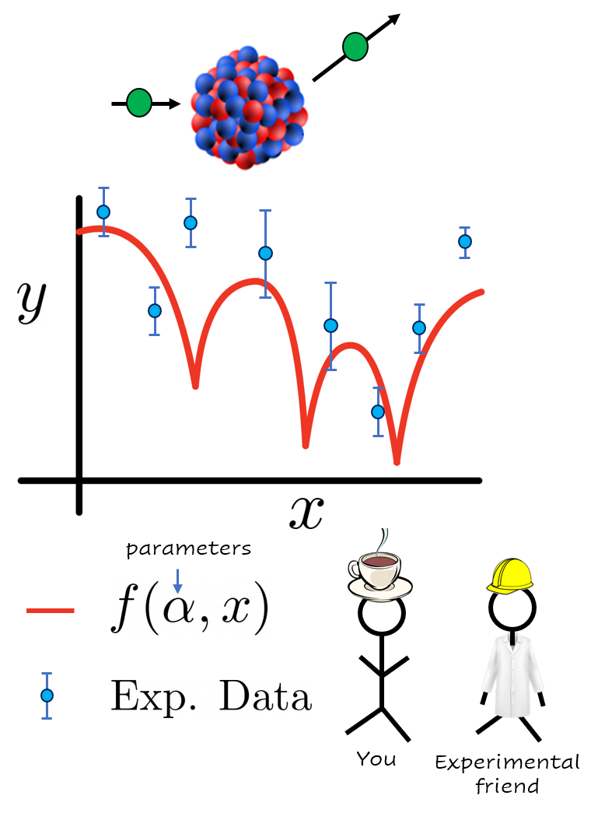
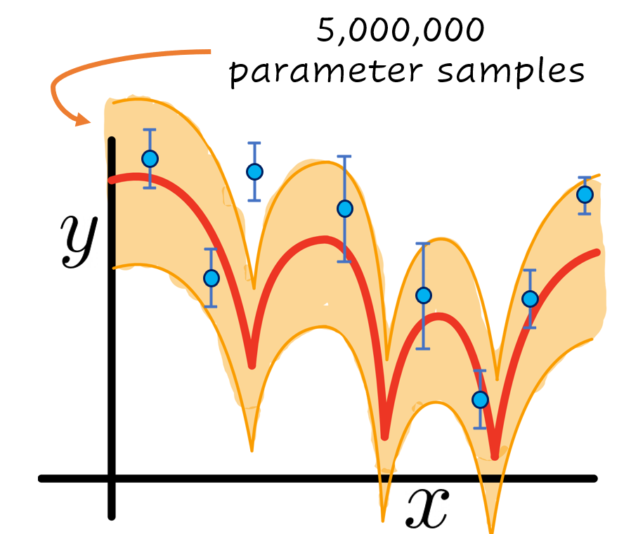
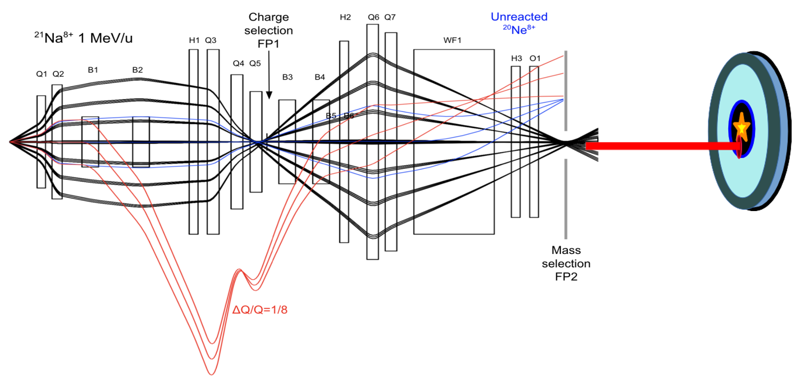

# Why emulators?

Contributed by: Pablo Giuliani, Ruchi Garg
Edited by: Kyle Godbey

Before we dive into the Reduced Basis Method, we first must look inward, deep inside our souls, and ask a fundamentally important question: why would we even want to learn about all this?

The Reduced Basis Method, from a practitioner point of view, can be thought of as an emulator, which is an algorithm that can be trained to “mimic” or approximate expensive calculations, usually with very little loss in accuracy, but with a gigantic gain in speed. If setting up the emulator is not too much of a hassle, then in principle we should always make use of them if the accuracy loss is indeed negligible. At the end of the day, performing the same calculation 100 times faster should be a great win for almost every research group. Let us walk you through two short examples, in which the speed up gain could not only be beneficial, but decisive in the amount of science that can be produced.

## First case: calibrating and quantifying the uncertainty of a physics model

Imagine that you and your colleagues have developed a nice physics model $f(\alpha,x)$ that depends on some list of parameters $\alpha$ and explains a phenomena we observe in nature as a function of the parameter $x$. For example, you could be modeling how likely it is for a neutron to interact with a nucleus as a function of the beam energy. The parameters $\alpha$ could be modeling, for example, how strongly the neutrons interact with other particles in the nucleus.

Figure1: Hypothetical situation you find yourself in after starting reading this book. Your model (in red) for a given parameter set $\alpha$ is compared with experimental data (in blue) your friends from the laboratory just measured.

You would like your model to compare well with the recent experimental data your friends have just measured at the laboratory after an expensive and long campaign. For that, you will have to explore the response of your model $f(\alpha,x)$ for different values of the parameters $\alpha$ until you find one that matches the observed data well. This can take several evaluations of your model, perhaps of the order of hundreds to several thousands, a task that could become very time consuming if each evaluation takes an appreciable time to compute. Here are two hypotetical examples on opposite sides of the computational burden spectrum:

If instead of just finding the set of optimal parameters $\alpha$ you are interested instead in finding a Bayesian posterior distribution of them to [quantify the uncertainty](https://bandframework.github.io/) of your model, things can quickly get out of hand. 

Figure 3: Same as Figure 1 with the addition of an uncertainty band in orange. In this hypotetical example, such band was built by sampling 5,000,000 values of the parameter $\alpha$ and evaluating the model $f(\alpha,x)$ to compare with the experimental data in blue.

These posteriors could sometimes take millions of evaluations to compute. If you were not to run them in parallel in a computer cluster, this will turn the total computational time needed to several years in the case of the simple model, and to several millennia in the case of the complex one. In these cases, an emulator becomes almost a required resource if you would like to finish your uncertainty quantification of your model $f(\alpha,x)$ within your lifetime.

## Second case, experimental optimization and online tune-up

Now let’s imagine that you put your experimental hat and you go to the laboratory to join the heroes that carefully measure nature in all its glory. An experimental set up consists of several elements and moving parts that all have to be synchronized almost to perfection to provide reliable data to the scientific community. For example, in the case of a facility that investigates rare nuclei, one such experimental set up, SECAR (Separator for Capture Reactions), is dedicated to studying the very low cross-section (i.e., probability) nuclear reactions. SECAR measures the reactions by separating the reaction product nuclei from the unreacted beam using a series of magnets. Figure 3 illustrates the different ions’ path as they traverse SECAR between the target location, where the reaction happens, and the final detection plane.

Figure 4: Adapted from [a recent study](https://doi.org/10.1103/PhysRevAccelBeams.25.044601) showing the focusing and defocusing of the reaction products (in black rays) and beam ions (in blue and red rays) as they pass through the dipoles, quadrupoles, hexapoles, octupoles, and Wien filters at SECAR.

Finding an optimal setting of the many parameters of the system to steer the beam and the reaction products in a desired manner can be challenging, involving computationally expensive simulations and manual fine tuning of several components. For such challenges, the use of an emulator that can mimic the response of the setup and/or reduce the effective dimensionality in the large parameter space could help tremendously in speeding up the general optimization process. The dimensionality reduction could also greatly speed up the fine tuning of the setup during the valuable beam time and thereby reducing the time spent on setting up the apparatus and maximizing the time in which useful data is being actively collected.

We hope these two examples have served as an appetizer to motivate you for further reading and studying these techniques. If so, please join us on our next chapter where we give an intuitive description on why any of these types of technique have a chance of working. In a nutshell, most of our computations and calculations involving varying parameters are highly redundant.

